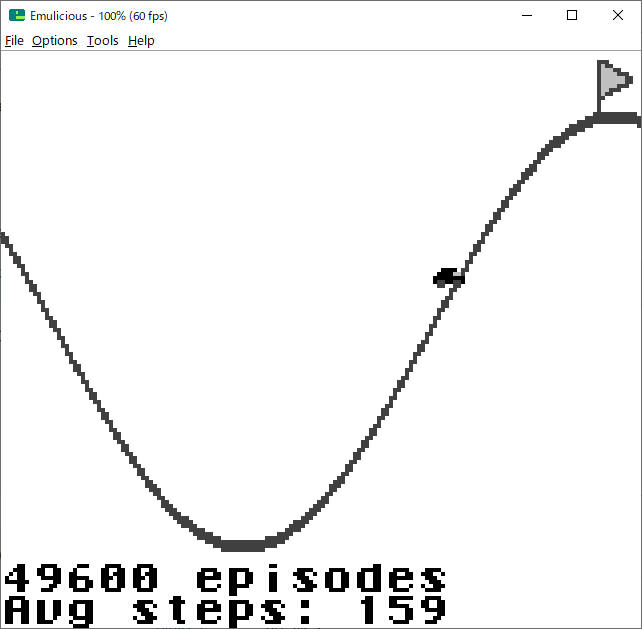
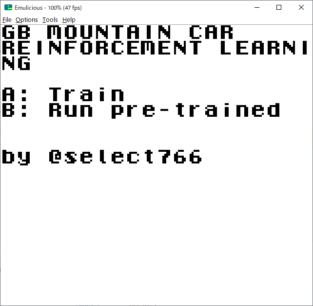

# ゲームボーイ上で強化学習を行う実験(MountainCar環境)

MountainCarというゲームをゲームボーイ上で強化学習によって解く。(Solving the game MountainCar on a Game Boy using reinforcement learning.)

約30分、2500エピソード程度で解けるようになる。

# アルゴリズム

Q学習。Qテーブルを使用する。ニューラルネットワークは不使用。Qテーブルは、状態として座標と速度の2つの次元を持ち、それぞれの値の領域を16分割している。行動は左、ニュートラル、右の3通り。要素は16bit整数で表現。メモリ上の容量は、16×16×3×2=1536bytes。

学習のコアは `gb/qlearning.c` に実装されている。

# ビルド

必要な環境

- Windows10
- GBDK2020
  - `<project_root>/../gbdk-win64/gbdk/bin/lcc.exe` が存在する想定
- Make
- MinGW (PC用プログラムビルド用)
- Python 3.10
  - `pip install -r requirements.txt`

`gb`フォルダ内で`make`を行い、`mountaincar.gb`を得る。これがゲームボーイソフトのROM。これをEmuliciousなどのエミュレータで実行する。GB Cart Flasherなどを用いてフラッシュカートリッジに書き込めば実機で動作させることも可能。
